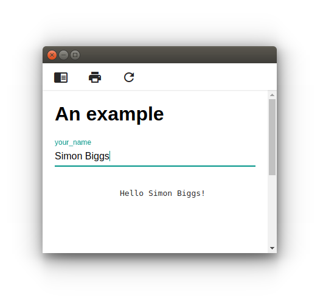
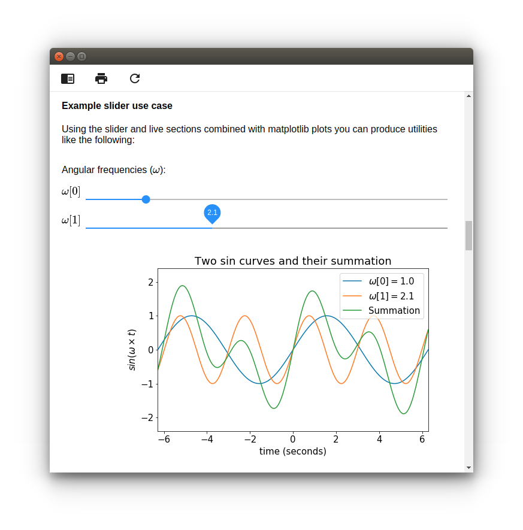

<!-- markdownlint-disable MD033 -->

# Scripted Forms [](https://travis-ci.org/SimonBiggs/scriptedforms) [](https://mybinder.org/v2/gh/SimonBiggs/scriptedforms-examples/master)

Making GUIs easy for everyone on your team.

The primary benefit is that front ends for Python code become easily accessible
to everyone on your team. Easy to use, easy to update, easy to extend, and easy
to understand.

* Quickly create live-update GUIs for Python packages using Markdown and a few custom HTML elements.
* Just write in markdown + variables / UI types
* Based on Jupyter

## Quick start

If you are on Windows and don't have a version of Python you might want to try
ScriptedFormsPortable. Download ScriptedFormsPortable from <https://github.com/SimonBiggs/scriptedforms/releases/latest>

However, as long as you have Python (>=3.5) on your computer installing
ScriptedForms is as simple as typing the following into a terminal (or command prompt):

```bash
pip install scriptedforms
```

Then to use it create a markdown file within your current directory called `quick-start.md` with any plaintext editor (such as 
[Visual Studio Code](https://code.visualstudio.com/)). 
Make the contents be the following:

~~~markdown
# An example

<section-live>

<variable-string>your_name</variable-string>

```python
print('Hello {}!'.format(your_name))
```

</section-live>
~~~

Then run the following in your terminal

```bash
scriptedforms quick-start.md
```

If everything worked, a Scripted Form should open within your default browser.
You should be able to type your name into the form and see the code field live
update with each key stroke:

<p align="center">
  
</p>

Now within `quick-start.md` edit the markdown file by changing

```markdown
# An example
```

to

```markdown
# The form updates when I change it
```

and then press save. The form in the browser should then update to match what
you just wrote.

### Plotting and slider example

If you want to be a bit more adventurous see what happens if you add the
following to the end of the your `quick-start.md` file (or any other
ScriptedForm):

~~~markdown
#### Example slider use case

Using the slider and live sections combined with matplotlib plots you can
produce utilities like the following:

<section-start>

```python
t = np.linspace(-2*np.pi, 2*np.pi, 500)
omega = np.ones(2)
```

</section-start>

<section-live>

Angular frequencies ($\omega$):

<variable-slider name="$\omega [0]$" min="0" max="6" step="0.1">omega[0]</variable-slider>
<variable-slider name="$\omega [1]$" min="0" max="6" step="0.1">omega[1]</variable-slider>

```python
plt.figure(figsize=(5*1.618,5))

oscillation = np.sin(t[:, np.newaxis] * omega[np.newaxis, :])
summation = np.sum(oscillation, axis=1)

plt.plot(t, oscillation)
plt.plot(t, summation)

plt.xlim([-2*np.pi, 2*np.pi])
plt.ylim([-2.4, 2.4])
plt.title('Two sin curves and their summation')
plt.legend([
    r'$\omega [0] = {0:0.1f}$'.format(omega[0]),
    r'$\omega [1] = {0:0.1f}$'.format(omega[1]),
    'Summation'], loc='upper right')
plt.xlabel('time (seconds)')
plt.ylabel(r'$sin(\omega \times t)$');
```

</section-live>
~~~

This should produce what is seen in the following screenshot:

<a href="https://mybinder.org/v2/gh/SimonBiggs/scriptedforms-examples/master">
  <p align="center">
    
  </p>
</a>

[Click here](https://mybinder.org/v2/gh/SimonBiggs/scriptedforms-examples/master) to see a live version of this example on mybinder.org. This will run slower online on that server than when you are using it locally.

### More features

For a markdown file that presents the majority of the features of scriptedforms
see
[detailed.md](https://raw.githubusercontent.com/SimonBiggs/scriptedforms/master/example/example/detailed.md).
Try writing some of the contents of that file into a ScriptedForm to see how
they work.

## Security notice

Be aware that ScriptedForms uses the [Jupyter Notebook Server security model](http://jupyter-notebook.readthedocs.io/en/stable/security.html#security-in-the-jupyter-notebook-server). When a user has access to the forms via the localhost web interface, should they have sufficient know how, they also have the ability to run arbitrary Python code without limitations.

By default only users on the local machine will be able to access the Jupyter Notebook Server which means if you trust a user to run code on their own machine then allowing them to use ScriptedForms will not cause issue. Only override these default settings if you understand and accept the security implications.

Furthermore do not run a scripted form unless you trust its origin. Given the reactive nature of ScriptedForms, code within the markdown template can run on form opening, as well as during usage.

## Example that can be used as a template for deployment

This is designed to be used as a quick and easy GUI for python packages. An
example package that creates a console script that then uses scriptedforms to
boot up a GUI can be found within the [example](./example) directory.

Within the [`README.md`](./example/README.md) file of that directory there is an
explanation of how you might go about deploying your utility with its new GUI.

## [Optional] Installing the Jupyter Server extension

ScriptedForms can also be installed as a [Jupyter Server extension](http://jupyter-notebook.readthedocs.io/en/stable/examples/Notebook/Distributing%20Jupyter%20Extensions%20as%20Python%20Packages.html#Enable-a-Server-Extension). Eventually this should allow the use of ScriptedForms with tools such as [JupyterHub](http://jupyterhub.readthedocs.io/en/latest/). This part of ScriptedForms is still a work in progress but if you want to give it a try then make sure you have at least version `0.5.15` of ScriptedForms and then run:

```bash
jupyter serverextension enable --py scriptedforms
```

Then to start ScriptedForms using its Jupyter Server extension run the following

```bash
jupyter notebook --NotebookApp.default_url=/scriptedforms/use/quick-start.md
```

## [Advanced users only] Installing scriptedforms from the GitHub source

The majority of users will not need to pay attention to this section.

For those who wish to build scriptedforms from the source provided within this
repository, instead of using pypi, the javascript bundle will need to be built.
To do this you will need to
[install `yarn`](https://yarnpkg.com/lang/en/docs/install/) and then run the
following in the
[directory containing the `package.json` file](./scriptedforms):

```bash
yarn
yarn build
yarn pip:install
```

This will install the node packages, build the javascript files and then run
`pip install -e .` to install the python package.

## Software license agreement

Scripted Forms -- Making GUIs easy for everyone on your team.

Copyright (C) 2017 Simon Biggs

This program is free software: you can redistribute it and/or modify
it under the terms of the GNU Affero General Public License as published
by the Free Software Foundation, either version 3 of the License, or
(at your option) any later version (the "AGPL-3.0+").

This program is distributed in the hope that it will be useful,
but WITHOUT ANY WARRANTY; without even the implied warranty of
MERCHANTABILITY or FITNESS FOR A PARTICULAR PURPOSE. See the
GNU Affero General Public License and the additional terms for more
details.

You should have received a copy of the GNU Affero General Public License
along with this program. If not, see <http://www.gnu.org/licenses/>.

ADDITIONAL TERMS are also included as allowed by Section 7 of the GNU
Affrero General Public License. These aditional terms are Sections 1, 5,
6, 7, 8, and 9 from the Apache License, Version 2.0 (the "Apache-2.0")
where all references to the definition "License" are instead defined to
mean the AGPL-3.0+.

You should have received a copy of the Apache-2.0 along with this
program. If not, see <http://www.apache.org/licenses/LICENSE-2.0>.

### Justification for using a copyleft license

I desire to seed a Medical Physics open source community within Australia.
Medical Physicists have been repeatedly blocked from giving code to the
community. There may be an opportunity for sharing however if there is an
existing IP agreement that distributed code or modifications will be
provided under the same license.

As such, to be able to seed a Medical Physics open source community within
Australia I need to create something that helps Medical Physicists write their
code and have it licensed under a copyleft license.

I hope this is that package.

For more information on why you as a Medical Physicist might want to use the
AGPL-3.0+ license read the [benefits of AGPL-3.0+ for Medical Physics](./Benefits-of-AGPL-3.0+-for-Medical-Physics.md).

### Justification for the inclusion of additional terms

A significant and justifiable fear within the Medical Physics community is that
should code be shared the author of the code may be liable for negligence. As
such specifically addressing negligence within the additional terms is a must
if this code base will become a seed to create a Medical Physics open source
community in Australia.

Within Australian courts if there is any ambiguity in liability exclusion
clauses they will be interpreted narrowly. If liability for negligence is not
expressly excluded it may not be read as excluded within an Australian court
(<https://eprints.qut.edu.au/7404/1/open_source_book.pdf> page 80).
The same is true for clauses which seek to exclude liability for consequential
loss.

The AGPL-3.0+ does not explicitly mention negligence anywhere within its
license text. The Apache-2.0 does. The AGPL-3.0+ in Section 7 does define
allowable additional terms. The negligence clauses within the Apache-2.0 fall
under these allowable additional terms so, as such, they have been included.

There are also other desirable features of the Apache-2.0 license such as
contribution, trademark, and warranty requirements. These were also included.

### A note about the code sharing license requirement

If you only ever use this code internally within your company to create GUIs
the only people who need to have access to the source code are those users
whom you distribute the program to. Therefore you do not need to share your
code outside of your company if your only users are within your company.

However there are significant benefits from sharing your code with the
community. Please read the [benefits of AGPL-3.0+ for Medical Physics](./Benefits-of-AGPL-3.0+-for-Medical-Physics.md).
