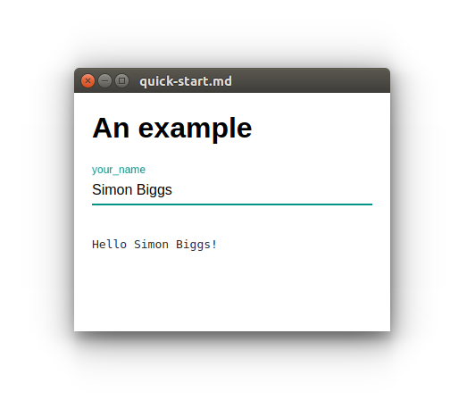

<!-- markdownlint-disable MD033 -->

# Scripted Forms

Making GUIs easy for everyone on your team.

The primary benefit is that front ends for Python code become easily accessible
to everyone on your team. Easy to use, easy to update, easy to extend, and easy
to understand.

## Quick start

If you would like to take scriptedforms for a spin first install it:

```bash
pip install scriptedforms
```

Then copy the following into a python prompt:

~~~python
import scriptedforms as sf

# workaround for https://github.com/SimonBiggs/scriptedforms/issues/24
def create_file(filename, contents):
    with open(filename, 'w') as f:
        f.write(contents)

filename = 'quick-start.md'
markdown_contents = """
# An example

<section-live>

<variable-string>your_name</variable-string>

```python
print('Hello {}!'.format(your_name))
```

</section-live>"""

create_file(filename, markdown_contents)
sf.load(filename)
~~~

Note that because scriptedforms relies on the jupyter notebook server
the above code cannot be run within a jupyter app itself. For example, that
means that you cannot use an `ipython` prompt or a jupyter notebook to run the
above code.

After running the above code, if everything worked, you should be able to type
your name into the form and see the code field live update with each key
stroke:

<p align="center">
  
</p>

Now open up the file `quick-start.md` in your favorite text editor.
Edit the markdown file by changing

```markdown
# An example
```

to

```markdown
# The form updates when I change it
```

and then press save. The form in the browser should then update to match what
you just wrote.

If you want to be a bit more adventurous see what happens if you add the
following to the end of the file:

~~~markdown
<section-live>

<variable-slider>a_number</variable-slider>

```python
print('Your number is {}'.format(a_number))
```

</section-live>
~~~

## More detailed markdown file

For a markdown file that presents the majority of the features of scriptedforms
see
[detailed.md](https://raw.githubusercontent.com/SimonBiggs/scriptedforms/master/example/example/detailed.md).
Try writing some of the contents of that file into `quick-start.md` to see how
the features of scriptedforms work.

A section of that form is shown below as a screenshot:

<p align="center">
  
</p>

## Example that can be used as a template for deployment

This is designed to be used as a quick and easy GUI for python packages. An
example package that creates a console script that then uses scriptedforms to
boot up a GUI can be found within the [example](./example) directory.

Within the [`README.md`](./example) file of that directory there is an
explanation of how you might go about deploying your utility with its new GUI.

## Installing scriptedforms from the GitHub source

The majority of users will not need to pay attention to this section.

For those who wish to build scriptedforms from the source provided within this
repository, instead of using pypi, the javascript bundle will need to be built.
To do this you will need to
[install `yarn`](https://yarnpkg.com/lang/en/docs/install/) and then run the
following in the
[directory containing the `package.json` file](./scriptedforms):

```bash
yarn
yarn build
```

After that you will be able to install the scriptedforms package from the
GitHub source.

## Software license agreement

Scripted Forms -- Making GUIs easy for everyone on your team.

Copyright (C) 2017 Simon Biggs

This program is free software: you can redistribute it and/or modify
it under the terms of the GNU Affero General Public License as published
by the Free Software Foundation, either version 3 of the License, or
(at your option) any later version (the "AGPL-3.0+").

This program is distributed in the hope that it will be useful,
but WITHOUT ANY WARRANTY; without even the implied warranty of
MERCHANTABILITY or FITNESS FOR A PARTICULAR PURPOSE. See the
GNU Affero General Public License and the additional terms for more
details.

You should have received a copy of the GNU Affero General Public License
along with this program. If not, see <http://www.gnu.org/licenses/>.

ADDITIONAL TERMS are also included as allowed by Section 7 of the GNU
Affrero General Public License. These aditional terms are Sections 1, 5,
6, 7, 8, and 9 from the Apache License, Version 2.0 (the "Apache-2.0")
where all references to the definition "License" are instead defined to
mean the AGPL-3.0+.

You should have received a copy of the Apache-2.0 along with this
program. If not, see <http://www.apache.org/licenses/LICENSE-2.0>.

### Justification for using a copyleft license

I desire to seed a Medical Physics open source community within Australia.
Medical Physicists within the public NSW health system have been repeatedly
blocked from giving code to the community. There is however an opportunity
for them to be able to give code if, and only if, there is an existing IP
agreement that distributed contributions or modifications will be provided
under the same license.

As such, to be able to seed a Medical Physics open source community within
Australia I need to create something that helps Medical Physicists write their
code and have it licensed under a copyleft license.

I hope this is that package.

For more information on why you as a Medical Physicist might want to use the
AGPL-3.0+ license read the [benefits of AGPL-3.0+ for Medical Physics](./Benefits-of-AGPL-3.0+-for-Medical-Physics.md).

### Justification for the inclusion of additional terms

A significant and justifiable fear within the Medical Physics community is that
should code be shared the author of the code may be liable for negligence. As
such specifically addressing negligence within the adittional terms is a must
if this code base will become a seed to create a Medical Physics open source
community in Australia.

Within Australian courts if there is any ambiguity in liability exclusion
clauses they will be interpreted narrowly. If liability for negligence is not
expressly excluded it may not be read as excluded within an Australian court
(<https://eprints.qut.edu.au/7404/1/open_source_book.pdf> page 80).
The same is true for clauses which seek to exclude liability for consequential
loss.

The AGPL-3.0+ does not explicitly mention negligence anywhere within its
license text. The Apache-2.0 does. The AGPL-3.0+ in Section 7 does define
allowable additional terms. The negligence clauses within the Apache-2.0 fall
under these allowable additional terms so, as such, they have been included.

There are also other desirable features of the Apache-2.0 license such as
contribution, trademark, and warranty requirements. These were also included.

### A note about the code sharing license requirement

If you only ever use this code internally within your company to create GUIs
the only people who need to have access to the source code are those users
whom you distribute the program to. Therefore you do not need to share your
code outside of your company if your only users are within your company.

However there are significant benefits from sharing your code with the
community. Please read the [benefits of AGPL-3.0+ for Medical Physics](./Benefits-of-AGPL-3.0+-for-Medical-Physics.md).